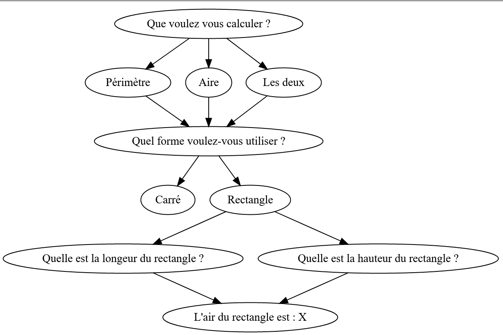

# CLI

## Objectif

Créer une commande-line interface qui va calculer l'aire ou le périmètre d'une forme donnée.

## Pré-requis

Avoir installé :

- [NodeJS](https://nodejs.org/en/)
- `NPM`

## Énoncé

### 1. Initialisation

Initialiser un nouveau projet NPM et installer [Inquirer](https://www.npmjs.com/package/inquirer).

Dans un nouveau fichier JavaScript, importer `Inquirer` et initialiser le CLI.

### 2. Formes

Formes :

- carré
- cercle
- rectangle
- triangle / triangle rectangle
- losange
- trapèze
- parallélogramme

> Attention le **triangle rectangle** est un dérivé du triangle classique, il faudra gérer ce cas à part sans
> le définir comme une forme à par entière

Pour chacune des formes suivantes créer les différentes étapes qui vont nous permettre de calculer l'aire et/ou le
périmètre de la forme sélectionnée.

Il faut également pouvoir demander à calculer l'aire ET le périmètre plutôt qu'une seule des deux valeurs.

**Exemple**

Graphique simplifié des étapes du CLI



```bash
$ node cli.js

Bienvenu dans le calculateur !
? Que voulez vous calculer ? Aire
? Quel forme voulez-vous utiliser ? Rectangle
? Quelle est la longeur du rectangle ? 5
? Quelle est la hauteur du rectangle ? 8
L'air du rectangle est : 40
```

> Rappel sur les calcules d'aire : https://www.comment-calculer.net/calcul-d-aire.php

> Rappel sur les calcules de périmètre : https://www.comment-calculer.net/calcul-perimetre.php

#### **Résultat attendu**

Avoir un CLI fonctionnel nous permettant en fonction des choix donnés d'avoir l'aire et/ou le périmètre dans le retour de la commande.
